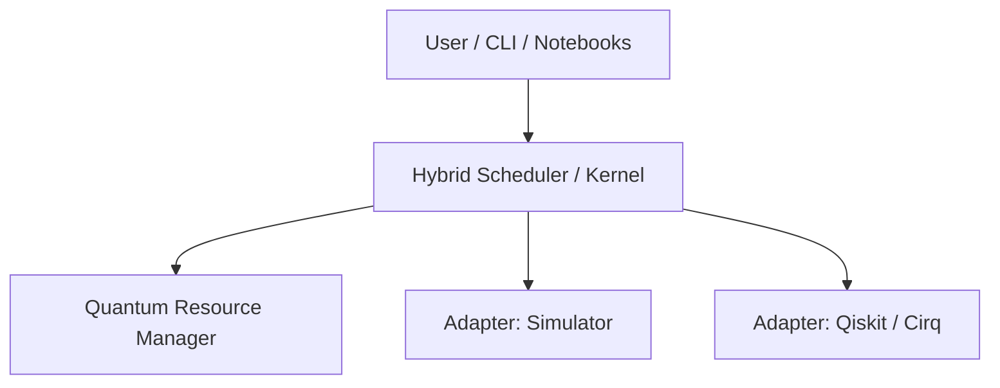

# QUATUMN    OS — Creation-Triad

# QuantumN OS


> **Status:** 🚧 Research prototype | Experimental OS-inspired framework for hybrid classical–quantum computing

---

## 📑 Table of Contents

* [Overview](#overview)
* [Motivation](#motivation)
* [Core Concepts](#core-concepts)
* [Features](#features)
* [System Architecture](#system-architecture)
* [Repository Structure](#repository-structure)
* [Getting Started](#getting-started)
* [Examples](#examples)
* [Development & Testing](#development--testing)
* [Contributing](#contributing)
* [Roadmap](#roadmap)
* [License](#license)
* [Contact](#contact)

---

## 🌌 Overview

**QUATUMNOS (Creation-Triad)** is a prototype project investigating how an *OS-like kernel* can coordinate **classical + quantum workloads**. It aims to explore:

* Scheduling strategies for hybrid computation
* Quantum resource allocation and management
* Abstraction layers for different quantum backends

⚠️ This is a **research-first** initiative. Expect instability and rapid iteration.

---

## 🎯 Motivation

As quantum hardware matures, we need system-level abstractions to:

* Manage scarce qubit resources efficiently
* Schedule hybrid workloads transparently
* Experiment with OS-inspired policies for distributed & quantum computing

This repo provides a testbed for such explorations.

---

## 🧩 Core Concepts

* **QTask** → Work unit combining classical + quantum stages
* **Hybrid Scheduler** → Decides execution order and backend usage
* **Quantum Resource Manager (QRM)** → Tracks qubits, fidelity, and allocation
* **Adapters** → Pluggable connectors for simulators and quantum SDKs (Qiskit, Cirq, etc.)

---

## ⚡ Features

✅ Lightweight hybrid job scheduling
✅ FIFO & priority-based scheduling
✅ Local simulator backend adapter
✅ Research notebooks & benchmarks
✅ Modular design for future backends

---

## 🏗 System Architecture



---

## 📂 Repository Structure

```
QUATUMNOS---CREATION-TRIAD/
├── adapters/        # Backend integrations (sim, qiskit, cirq)
├── core/            # Scheduler, QTask, QRM
├── examples/        # Runnable demo jobs
├── notebooks/       # Research notebooks
├── tests/           # Unit/integration tests
├── docs/            # Design docs & diagrams
├── LICENSE
└── README.md
```

---

## 🚀 Getting Started

### Prerequisites

* Python 3.10+
* Virtualenv / Poetry
* (Optional) Qiskit or Cirq

### Installation

```bash
git clone https://github.com/DEMOTESTERPROJECTS-developerpattaehyung/QUATUMNOS---CREATION-TRIAD.git
cd QUATUMNOS---CREATION-TRIAD

python -m venv .venv
source .venv/bin/activate   # Linux/macOS
.\.venv\Scripts\activate    # Windows

pip install -r requirements.txt
```

---

## 📘 Examples

Run a sample hybrid job on the simulator backend:

```bash
python examples/run_hybrid_example.py --backend sim
```

---

## 🧪 Development & Testing

Run tests:

```bash
pytest -q
```

Use linters & formatters:

```bash
flake8 core/
black .
```

---

## 🤝 Contributing

We welcome contributions! 🚀

1. Fork & clone
2. Create a feature branch `git checkout -b feat/my-feature`
3. Add tests + docs
4. Submit PR with clear description

See [`CONTRIBUTING.md`](./CONTRIBUTING.md) for guidelines.

---

## 📍 Roadmap

* [ ] Stabilize core scheduler API
* [ ] Add Cirq & cloud backend adapters
* [ ] Implement advanced scheduling heuristics
* [ ] CI pipelines for reproducibility
* [ ] Benchmark suite publication

---

## 📜 License

Licensed under **Business Source License (BSL-1.0)**. See [LICENSE](./LICENSE).

---

## 📬 Contact

* Author: [DEMOTESTERPROJECTS-developerpattaehyung](https://github.com/DEMOTESTERPROJECTS-developerpattaehyung)
* Issues & Suggestions: Open a [GitHub Issue](../../issues)

---

✨ *QUATUMNOS — Towards the future of OS-level quantum orchestration* ✨
